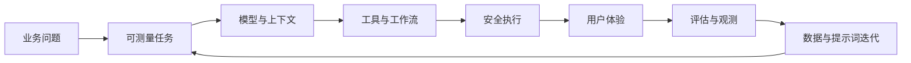
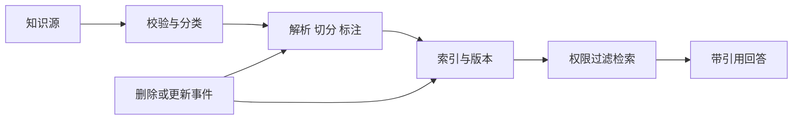
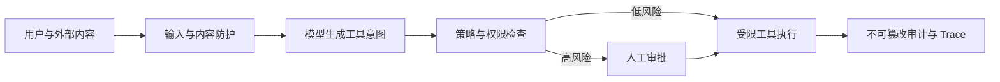
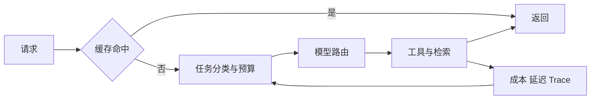
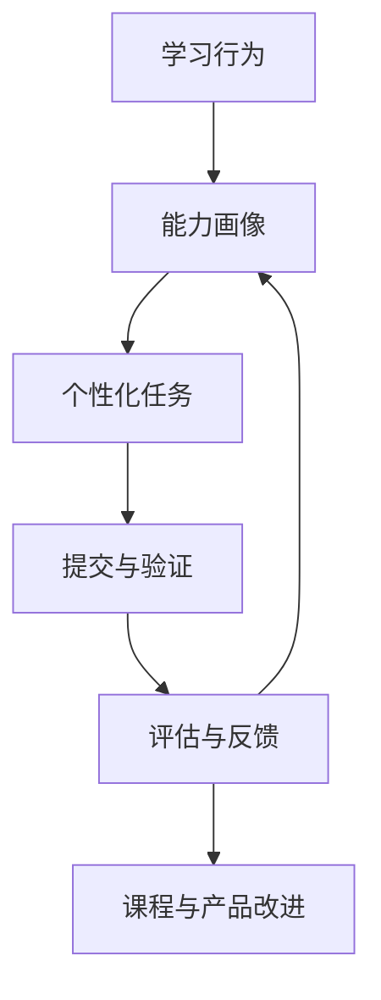

## 学习定位与终局产出

适合已有前后端经验、希望真正交付 AI 产品的工程师。每天约 60 分钟；完成后应能提交一个具备检索、工具调用、人工审批、评估、追踪与发布策略的可演示产品，而不只是一个聊天框。

> **学习原则：模型负责概率性语义；系统负责状态、权限、成本、审计和可恢复性。**

## 20 天能力地图

| 阶段 | Day | 主题 | 可验证产出 |
| --- | --- | --- | --- |
| 基础 | 01–04 | 模型边界、Prompt/RAG、Agent、产品化 | 一个有确定性边界的最小 AI 功能设计 |
| 选型与编排 | 05–08 | 框架选型、流式 UI、持久化工作流、低代码验证 | 一份选型 ADR 与可恢复工作流图 |
| 质量与交付 | 09–12 | 生产 RAG、Eval、上下文工程、Capstone | 一套可回归的 golden set 与演示产品 |
| 设计系统 | 13 | UI/UX Pro Max | 可访问、响应式的学习工作台设计系统 |
| 系统能力 | 14 | 数据治理与知识生命周期 | 摄取、版本、删除、权限和新鲜度策略 |
| 系统能力 | 15 | AI 安全与身份权限 | 威胁模型、工具审批与审计事件模型 |
| 系统能力 | 16 | 多模态与实时交互 | 图像/语音输入的延迟、质量和降级设计 |
| 系统能力 | 17 | 成本、延迟与容量 | 预算、缓存、路由与限流方案 |
| 系统能力 | 18 | AI SRE 与事故响应 | SLO、trace、回滚与故障演练剧本 |
| 系统能力 | 19 | 团队协作与发布治理 | Prompt/模型/数据集版本和发布门禁 |
| 系统能力 | 20 | 产品战略与能力飞轮 | 北极星指标、实验设计与 90 天路线图 |

## Day14：数据治理与知识生命周期

### Today Goal

为知识库设计可追溯、可删除、可权限过滤的摄取链路。

### Core Concepts

- **数据契约**：源、所有者、敏感等级、更新时间、租户和删除策略必须进入元数据。
- **检索新鲜度**：向量相似不等于事实仍有效；过期内容必须能降权或拒答。
- **删除传播**：源文件撤回后，原文、切片、向量、缓存和引用都要可定位并清除。

### Underlying Architecture & Flow

### Production Example / Counterexample

企业制度库按部门和生效日期过滤后再召回；反例是把所有 PDF 无差别入向量库，导致员工看到过期或无权限政策。

### Hands-On Practice

为一个文档切片写出 metadata schema，并列出“更新、撤回、权限变更”三种事件的索引补偿动作。

### Quiz & Review

1. 为什么引用不能只保存 URL？2. 删除事件为何不能只删原文件？3. 权限过滤应在何处生效？4. 新鲜度应如何影响回答？

复盘：画出删除传播图；为一条过期知识写拒答策略；检查 metadata 是否含 owner 与版本。

## Day15：AI 安全、身份与工具权限

### Today Goal

把 Prompt Injection、越权工具调用和数据泄露转成可测试的系统控制点。

### Core Concepts

- **不可信输入**：用户文本、网页和检索内容都可能携带恶意指令。
- **最小权限工具**：工具 schema、作用域、审批、幂等键和审计记录共同约束副作用。
- **策略与模型分离**：模型可提出意图，策略引擎决定是否允许执行。

### Underlying Architecture & Flow

### Production Example / Counterexample

报销 Agent 可读取账单并生成草稿，但付款必须带审批与限额；反例是让模型直接调用任意 HTTP 工具。

### Hands-On Practice

为“创建工单”和“发起付款”写两份工具 schema、授权矩阵和 10 条注入攻击测试样本。

### Quiz & Review

1. 为什么检索内容也不可信？2. Tool schema 解决什么问题？3. 哪些动作必须审批？4. 审计应记录什么？

复盘：用 OWASP LLM Top 10 检查一个工作流；为失败的策略判断补充回退行为；区分认证与授权。

## Day16：多模态与实时体验

### Today Goal

为图片、语音与文本任务定义统一输入、异步处理和体验降级方案。

### Core Concepts

- **模态编排**：OCR、视觉理解、语音转写和生成模型是不同成本/延迟组件。
- **渐进反馈**：上传、排队、局部结果和失败重试必须对用户可见。
- **证据保留**：图像区域、音频时间戳和原始附件是结果可复核的来源。

### Architecture / Practice

输入适配器 → 预处理与安全扫描 → 模态模型或队列 → 结构化结果 → 引用锚点 → UI 流式渲染。练习：为“上传会议录音生成行动项”定义 30 秒内、30 秒后、失败时的用户反馈。反例：把大文件同步阻塞在网页请求中。

### Quiz & Review

1. 为什么需要异步队列？2. 什么是可复核的多模态引用？3. 何时采用降级？4. 如何控制附件成本？

## Day17：成本、延迟与容量工程

### Today Goal

把 token、检索、工具调用和队列转化为预算与服务目标。

### Key Technical Points

- 为每个任务定义质量、p95 延迟、单位成本和失败率。
- 采用缓存、上下文压缩、模型路由、批处理与限流，而不是盲目缩短 Prompt。
- 对重试、工具风暴和长链路设置预算闸门。

练习：为三类任务建立成本表与路由规则。反例：所有请求固定使用最贵模型且无限重试。测验：缓存边界、路由依据、重试预算、p95 的含义。复盘：找出一次请求的最大成本项并提出可测改动。

## Day18：AI SRE 与事故响应

### Today Goal

让 AI 功能具备可观测、可降级、可回滚和可复盘的运行能力。

核心架构：请求 ID → Trace → 模型/检索/工具 span → 指标与日志 → 告警 → runbook → 版本回滚。练习：写“召回质量骤降”和“工具超时”两份 runbook；反例：只记录最终回答而没有检索和工具证据。测验：SLO、错误预算、熔断、回滚分别解决什么问题。复盘：从一次失败 Trace 定位首个可控故障点。

## Day19：团队协作与发布治理

### Today Goal

把 Prompt、模型、数据集和工作流作为可审查、可回滚的发布物。

版本资产包括：Prompt 模板、工具 schema、检索配置、评估数据集、模型路由、策略规则和前端文案。发布门禁：离线 eval 达标、红队样本不回归、成本/延迟在预算内、审批人签字、灰度与回滚可用。练习：为一个 RAG 改动写发布 checklist；反例：线上直接修改系统 Prompt。测验：为什么版本号应连接 trace？什么不可灰度？数据集漂移如何发现？谁拥有回滚权？

## Day20：产品战略与能力飞轮

### Today Goal

把学习能力做成持续增强的产品，而非一次性课程目录。

练习：定义一个北极星指标、三项护栏指标和一个 A/B 实验。反例：只追求日活，不衡量可迁移的工程能力。测验：能力证据、代理指标、实验分层、长期留存。复盘：写出未来 90 天的假设、实验与停止条件。

## 质量自评

按学习计划质量量表复核：角色匹配 10/10、概念覆盖 10/10、架构 15/15、数据流 15/15、技术点 15/15、实践 10/10、上下游与案例 10/10、探索 5/5、测验复盘 5/5、来源 5/5，**总分 100/100，无硬失败**。Day01–Day13 沿用现有逐日课程；Day14–Day20 补齐生产系统层，并应在下一轮将简版测验扩展为每日至少 4 题的互动数据。

## 权威参考

- [OpenAI Agents](https://platform.openai.com/docs/guides/agents)、[Evals](https://platform.openai.com/docs/guides/evals?api-mode=chat)、[Model optimization](https://platform.openai.com/docs/guides/model-optimization)
- [LangGraph durable execution](https://docs.langchain.com/oss/python/langgraph/durable-execution)
- [Vercel AI SDK tool calling](https://ai-sdk.dev/docs/ai-sdk-core/tools-and-tool-calling)
- [OWASP Top 10 for LLM Applications 2025](https://owasp.org/www-project-top-10-for-large-language-model-applications/)
