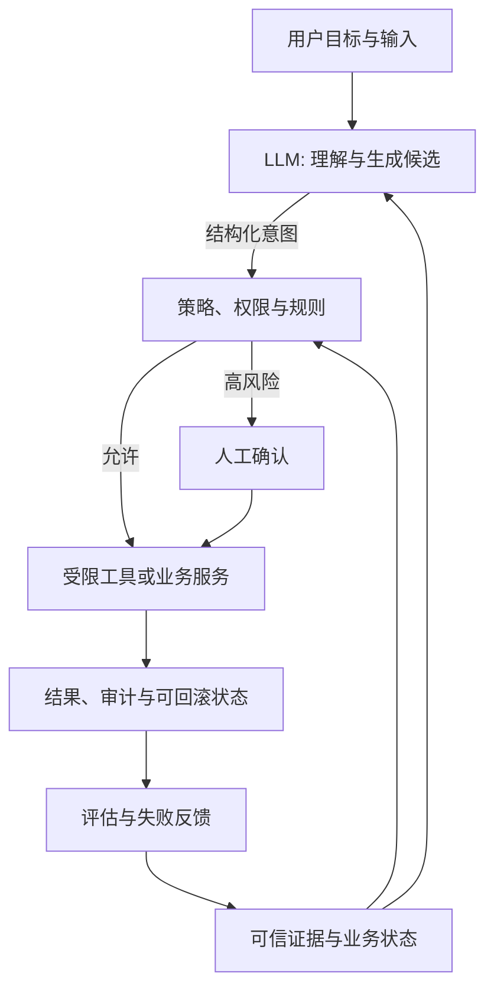

<!-- architecture
{"title":"模型建议与系统控制边界","summary":"模型负责理解与建议；权限、状态和高风险动作由可审计系统控制。","type":"boundary","nodes":[{"label":"用户目标","tone":"accent"},{"label":"模型建议"},{"label":"策略与权限","tone":"system"},{"label":"业务系统状态","tone":"system"},{"label":"可审计动作","tone":"warning"}]}
-->

## 今日目标

把一个模糊的“接入 AI”需求改写成可验证的工程任务，并能说明哪些责任属于模型、哪些必须属于确定性系统。

完成后，你应能为一个业务场景写出：

- 用户结果与成功指标；
- 模型可做的语义工作；
- 不可交给模型的状态、权限和副作用；
- 失败时的兜底与人工确认路径。

## 为什么重要

> **模型负责生成候选；系统负责承担后果。**

多数 AI 项目并非败于模型能力不足，而是把概率输出误当成业务事实。一个回答看似正确的退款助手，如果能直接改变订单状态或调用付款接口，就把金额、风控和审计交给了不可预测的文本生成。

## 核心概念

### 1. 从“想做 AI”改写为可测任务

先问三个问题：

1. **用户要完成什么结果？** 例如“理解退款资格”，而不是“和机器人聊天”。
2. **什么证据能证明结果正确？** 例如订单状态、退款规则版本和可引用的政策条款。
3. **错误的代价是什么？** 解释错误可提示复核；金额、身份或外部写入必须进入规则和审批。

| 任务 | 推荐形态 | 成功指标 | 不能交给模型的部分 |
| --- | --- | --- | --- |
| 总结会议纪要 | Chat + 结构化输出 | 行动项完整率 | 发布与负责人确认 |
| 回答制度问题 | RAG + 引用 | 引用覆盖率、拒答率 | 权限过滤、制度生效日期 |
| 创建退款草稿 | Workflow + 工具 | 草稿准确率 | 金额、资格、提交和状态变更 |
| 调查异常订单 | Agent + 审批 | 调查完成率、人工接管率 | 付款、删除、对外发送 |

### 2. LLM 是概率性语义组件，不是业务函数

LLM 根据上下文预测下一个 token 的分布，再采样生成结果。同一输入可能得到不同措辞、不同遗漏和不同工具参数。因此它适合：

- 意图识别、信息抽取、归类、总结和候选生成；
- 把非结构化语言变为待校验的结构化草稿；
- 在明确约束下提出下一步建议。

它不适合单独决定：权限、金额、库存、订单状态、合规结论、审计结果与不可逆操作。

### 3. 上下文是本轮工作台，不是长期记忆

本轮上下文应只包含完成当前任务所需的可信信息：用户输入、已授权的业务状态、相关证据片段、工具结果和输出约束。项目约定、用户偏好、历史结论与原始资料应持久化并按需检索。

**更多上下文不等于更可靠。** 噪声、过期内容与越权资料会同时提高成本、延迟和错误风险。

### 4. Token 与 temperature 是工程参数

- **Token：** 同时影响成本、首 token 延迟、总时延和注意力稀释；先筛选、检索和压缩，再组合上下文。
- **Temperature：** 调整采样发散程度；低温更适合提取和分类，但不能替代事实来源、schema 校验或评估。
- **结构化输出：** 让模型返回可解析的候选字段；它减少格式不确定性，但业务规则仍由系统执行。

## 底层架构：责任关系图

这不是线性流水线，而是相互约束的责任网络：



### 数据与逻辑流

1. 请求进入时，系统识别任务、风险等级与可用证据。
2. 系统只把已授权、仍有效的事实组成上下文包。
3. 模型输出意图或草稿，格式通过 schema 解析。
4. 策略层校验权限、金额、状态机条件、幂等键与风险等级。
5. 低风险操作由受限工具执行；高风险操作等待人工确认。
6. 结果、证据版本、工具事件和失败原因进入审计与评估闭环。

## 关键技术点

- 为每个模型输出定义 schema、字段含义、空值语义与失败处理。
- Prompt、检索片段和工具结果都属于不完全可信输入；不要把其中的自然语言当系统指令执行。
- 让副作用工具具备最小权限、幂等键、限额与审计记录。
- 以任务级指标验证：正确性、引用、拒答、人工接管、p95 延迟与单位成本。

## 上下游关系

上游需要业务目标、风险等级、数据来源、权限模型与成本预算。下游会进入 Day02 的 Prompt/工具契约、Day03 的证据与 RAG、Day04 的工作流与审批、Day05 的状态化 Agent，以及后续评估、观测和发布治理。

## 生产案例

**退款助手：** 模型识别用户是否询问退款、提取订单号并生成解释草稿；订单服务查询资格，规则引擎计算金额，风控策略判断是否需要人工确认，最终状态变更由后端服务和审计日志完成。

## 反例

“如果模型置信度高于 0.9，就直接调用付款接口。”

置信度是模型自报或分类分数，不是授权、余额、合规与幂等性的替代品。即使输出格式正确，也可能使用过期规则、错误订单或遭受提示注入。

## 动手实践

选择一个熟悉场景（客服、审批、知识库、运营或代码助手），完成一页《AI 任务边界卡》：

```text
用户结果：
成功指标：
模型负责：
可信证据：
系统控制：
高风险动作与人工确认：
失败兜底：
需要记录的审计证据：
```

交付物保存到 `labs/` 或 `projects/`。检查它是否明确写出一个模型不能决定的动作和一个可量化验收指标。

## 探索题

将同一个退款解释任务分别置于“只有用户输入”“加入订单状态”“加入政策引用与权限过滤”三种上下文中，比较答案差异。指出哪些问题是采样造成的，哪些问题是证据缺失造成的。

## 测验（100 分）

1. **架构判断，30 分：** 为什么退款金额与订单状态不能由 LLM 直接决定？
   - 正确要点：它们涉及确定性规则、权限、审计和不可逆副作用；模型只能提供意图或草稿。
2. **应用诊断，25 分：** 内部制度问答系统回答了已废止政策。最先补的控制点是什么？
   - 正确要点：来源版本、生效日期和权限过滤进入检索与上下文构造，而非只调低 temperature。
3. **概念辨析，20 分：** `temperature = 0` 能保证事实正确吗？为什么？
   - 正确要点：不能；它只控制采样发散，事实依赖可信证据、工具查询和校验。
4. **系统设计，15 分：** 工具调用为什么要带 schema、作用域和幂等键？
   - 正确要点：约束参数、限制权限、避免重试造成重复副作用，并使审计可追踪。
5. **成本判断，10 分：** 为什么不能把整个知识库直接拼进 Prompt？
   - 正确要点：成本、延迟、注意力稀释、过期/越权信息和上下文窗口限制都会降低可靠性。

## 复盘与强化

1. 不看资料重画“模型—证据—策略—执行—审计”的责任关系图。
2. 为本日四个概念各写一个失败模式与一个验证方法。
3. 把《AI 任务边界卡》交给同事或未来的自己阅读；若无法一眼看出谁能改变业务状态，就继续简化。

## 参考资料

- OpenAI，Agents 指南：<https://platform.openai.com/docs/guides/agents>
- OpenAI，结构化输出：<https://platform.openai.com/docs/guides/structured-outputs>
- OpenAI，Evals 指南：<https://platform.openai.com/docs/guides/evals>
- OWASP，LLM 应用 Top 10：<https://owasp.org/www-project-top-10-for-large-language-model-applications/>
