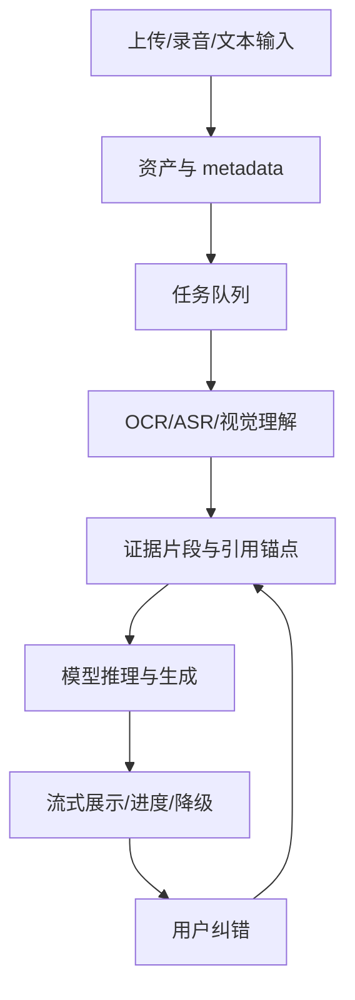

# Day16 多模态与实时体验

<!-- architecture
{"title":"多模态异步处理流水线","summary":"图片、语音和文本先统一为任务资产，再抽取证据、生成输出并展示进度与降级状态。","type":"pipeline","nodes":[{"label":"多模态输入","tone":"accent"},{"label":"Asset Metadata"},{"label":"任务队列","tone":"system"},{"label":"OCR / ASR / Vision"},{"label":"证据锚点","tone":"system"},{"label":"模型生成"},{"label":"进度与降级","tone":"warning"}],"feedback":"用户纠错回流到证据锚点和任务 contract。"}
-->

## Today Goal

为图片、语音与文本任务定义统一输入、异步处理、可复核引用和体验降级方案。

## Why This Matters

多模态体验容易被演示效果带偏：上传图片、听懂语音、生成文本都很炫，但生产系统真正需要的是可追踪输入、可解释输出、延迟可控和失败可恢复。

## Core Concepts

- **Multimodal input contract**：不同模态都要统一成 task、asset、metadata、privacy、expected output。
- **Async pipeline**：OCR、转写、视觉理解和生成模型的延迟不同，长任务应进入队列。
- **Grounded citation**：多模态回答要能引用图片区域、音频时间段、文本片段或文件版本。
- **Graceful degradation**：实时能力失败时，应降级为上传后处理、摘要、草稿或稍后通知。

## Underlying Architecture

建议使用 **分层流水线图**：前端输入层收集 asset，任务层排队，模态处理层抽取证据，推理层生成输出，体验层展示进度与降级状态。

## Data And Logic Flow

输入是图片、音频、视频片段或文本；系统先保存资产与隐私级别，再创建任务；处理层输出文本、结构化对象和引用锚点；模型基于证据生成结果；前端展示进度、可取消状态和引用证据。

## Key Technical Points

- 附件成本与延迟常常高于文本，必须限制大小、页数、时长和并发。
- 实时体验要设计 partial result、timeout、retry、cancel 和 fallback。
- 多模态引用需要坐标、时间戳或文件版本，否则用户无法复核。
- 隐私策略要在上传前就提示，而不是处理完再补说明。

## Upstream Dependencies And Downstream Applications

- 上游依赖：文件上传、存储、隐私分类、任务队列、模型能力。
- 下游应用：票据理解、会议纪要、图片质检、客服附件分析、教学反馈。

## Production Example

会议助手先将音频转写为带时间戳 transcript，再生成行动项；每个行动项能回跳到原始时间段，实时失败时保留“处理中”状态并稍后通知。

## Counterexample

直接把整段视频发给模型生成总结，不保存转写、时间戳和输入版本；用户指出摘要错误时无法定位证据。

## Hands-On Practice

为“上传产品截图并生成 UI 问题列表”设计任务 contract。交付字段包括 asset metadata、处理队列状态、视觉证据锚点、输出结构和降级策略。

## Exploration Prompt

比较实时语音交互和上传后批处理：列出各自的用户价值、成本风险和失败体验。

## Quiz

1. 为什么多模态任务通常需要异步队列？
2. 什么是可复核的多模态引用？
3. 什么时候应该采用体验降级？
4. 如何控制附件带来的成本和延迟？

## Review And Reinforcement

- 为一种模态写出输入 contract。
- 为一个超时场景写出 UI 状态机。
- 检查输出是否能回到原始证据。

## References

- https://platform.openai.com/docs/guides/images
- https://platform.openai.com/docs/guides/speech-to-text
- https://vercel.com/docs/workflow-collaboration/vercel-queues
