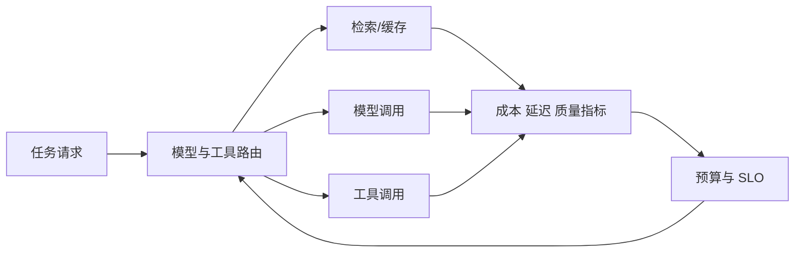

# Day17 成本、延迟与容量工程

<!-- architecture
{"title":"成本延迟预算控制闭环","summary":"路由器依据质量、预算和 SLO 选择模型与工具，运行指标再回写下一轮路由策略。","type":"feedback","nodes":[{"label":"任务请求","tone":"accent"},{"label":"预算检查"},{"label":"模型 / 工具路由","tone":"system"},{"label":"检索与缓存"},{"label":"模型调用"},{"label":"成本延迟指标","tone":"warning"},{"label":"预算与 SLO","tone":"system"}],"feedback":"指标超过阈值时触发缓存、降级、排队或轻量模型路由。"}
-->

## Today Goal

把 token、检索、工具调用和队列转化为预算、服务目标、路由规则和容量计划。

## Why This Matters

AI 产品的成本不是上线后才出现的问题。模型选择、上下文长度、检索次数、工具调用、重试和队列都会决定用户体验和毛利。

## Core Concepts

- **Unit economics**：按任务记录输入 token、输出 token、检索、工具、存储和人工审核成本。
- **Latency budget**：把 p95 延迟拆到前端、网关、检索、模型、工具和后处理。
- **Model routing**：按任务风险、质量要求、上下文长度和预算选择模型或降级路径。
- **Retry budget**：重试必须有上限，并区分瞬时错误、策略拒绝和质量失败。

## Underlying Architecture

建议使用 **反馈闭环图**：请求进入路由器，路由器依据预算和质量目标选择模型/工具，观测结果回写成本与延迟表，下一轮调整路由。

## Data And Logic Flow

输入是任务类型、用户等级、风险等级和上下文规模；处理过程包括预算检查、缓存命中、模型路由、工具调用、重试与降级；输出是回答和指标记录；反馈来自质量评估、用户评分、延迟告警和成本阈值。

## Key Technical Points

- p95 比平均值更能代表多数用户遇到的尾延迟。
- 缓存适合稳定、低风险、可复用的中间结果，不适合权限敏感或高变化内容。
- 最贵模型不应该是默认路径，除非质量评估证明收益超过成本。
- 预算超限时要有明确降级，例如减少检索、换轻量模型、异步处理或提示稍后返回。

## Upstream Dependencies And Downstream Applications

- 上游依赖：任务分类、模型价格、日志、trace、队列和用户等级。
- 下游应用：SLO、预算告警、灰度发布、团队成本治理和产品定价。

## Production Example

AI 教练把“解释概念”路由到轻量模型，把“审阅项目架构”路由到高质量模型，并为每类任务记录单位成本、p95 延迟和用户采纳率。

## Counterexample

所有请求都使用最贵模型、无限重试、检索 20 条上下文；短期效果看似好，长期成本和延迟失控。

## Hands-On Practice

为三类任务建立成本表和路由规则：概念解释、代码审查、项目方案评审。交付物包括质量目标、p95 延迟、单位成本上限、模型选择和降级策略。

## Exploration Prompt

挑一个现有 AI 功能，找出最大成本项，并提出一个不降低核心质量的可测优化。

## Quiz

1. 缓存边界应该由什么决定？
2. 模型路由可以依据哪些信号？
3. 为什么重试需要预算？
4. p95 延迟比平均延迟多说明了什么？

## Review And Reinforcement

- 画出一次请求的成本构成。
- 给一个高延迟 span 写优化方案。
- 为预算超限设计三档降级。

## References

- https://platform.openai.com/docs/guides/latency-optimization
- https://platform.openai.com/docs/guides/production-best-practices
- https://docs.sentry.io/product/performance/metrics/
