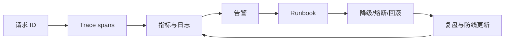

# Day18 AI SRE 与事故响应

<!-- architecture
{"title":"AI 事故响应生命周期","summary":"SLO 告警进入分诊、降级、回滚、沟通和无责复盘，最后沉淀 runbook 与测试。","type":"state","nodes":[{"label":"SLO 告警","tone":"warning"},{"label":"Trace 分诊"},{"label":"降级 / 熔断","tone":"system"},{"label":"回滚恢复","tone":"accent"},{"label":"用户沟通"},{"label":"无责复盘"},{"label":"Runbook 更新","tone":"system"}],"feedback":"复盘行动项进入发布门禁和演练计划。"}
-->

## Today Goal

让 AI 功能具备可观测、可降级、可回滚和可复盘的运行能力。

## Why This Matters

AI 事故往往不是单点报错，而是检索质量、模型输出、工具超时、权限策略或发布变更共同造成。没有 trace 和 runbook，团队只能凭感觉修。

## Core Concepts

- **SLO**：为质量、延迟、可用性和成本设置可监控目标。
- **Trace**：将一次请求拆成模型、检索、工具、策略和前端 span。
- **Circuit breaker**：当工具、检索或模型失败率超过阈值时自动降级。
- **Rollback**：Prompt、模型、数据集、检索配置和前端都应可回滚到已知稳定版本。

## Underlying Architecture

建议使用 **事故生命周期图**：请求带 request id，经过 trace 和指标，触发告警，进入 runbook，执行降级/回滚，最后复盘并更新防线。

## Data And Logic Flow

输入是线上请求和版本信息；系统记录 trace、模型参数、检索结果、工具调用、错误码和成本；告警根据 SLO 触发；on-call 按 runbook 执行缓解；事故结束后形成复盘和回归样本。

## Key Technical Points

- 只记录最终回答无法定位检索、工具或策略失败。
- Runbook 要写触发条件、排查步骤、缓解动作、回滚路径和沟通模板。
- AI 质量事故需要样本和版本上下文，不能只看 HTTP 500。
- 回滚目标必须包括 prompt、模型路由、数据集和检索配置。

## Upstream Dependencies And Downstream Applications

- 上游依赖：日志、trace、版本管理、告警、发布系统。
- 下游应用：事故响应、质量回归、发布门禁、团队治理。

## Production Example

一次“召回质量骤降”事故中，trace 显示检索召回数量从 8 降到 1，根因是 metadata 过滤规则发布错误；团队回滚检索配置并把样本加入回归集。

## Counterexample

客服机器人回答错误后，系统只有最终文本，没有 request id、检索片段和模型版本，团队无法判断是知识过期、检索失败还是模型幻觉。

## Hands-On Practice

写两份 runbook：“召回质量骤降”和“工具超时”。每份包含 SLO、告警条件、排查步骤、缓解动作、回滚路径和复盘样本。

## Exploration Prompt

找一个 AI 功能，设计一个“不影响所有用户”的灰度熔断策略。

## Quiz

1. SLO 和普通监控指标有什么区别？
2. Trace 为什么要覆盖检索和工具 span？
3. 熔断解决什么问题？
4. 回滚 AI 功能时哪些资产必须一起回滚？

## Review And Reinforcement

- 从一次失败 trace 定位首个可控故障点。
- 为一个质量事故添加回归样本。
- 检查 runbook 是否能由非作者执行。

## References

- https://sre.google/sre-book/service-level-objectives/
- https://opentelemetry.io/docs/concepts/signals/traces/
- https://platform.openai.com/docs/guides/production-best-practices
