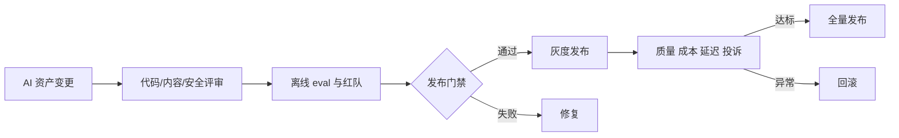

# Day19 团队协作与发布治理

<!-- architecture
{"title":"AI 资产发布门禁","summary":"Prompt、模型、数据集、工作流和检索索引都作为版本化资产进入评审、灰度和回滚。","type":"gate","nodes":[{"id":"n1","label":"版本化 AI 资产","tone":"system","group":"g1"},{"id":"n2","label":"变更评审","group":"g1"},{"id":"n3","label":"离线 Eval","group":"g2"},{"id":"n4","label":"红队门禁","tone":"warning","group":"g2"},{"id":"n5","label":"灰度发布","tone":"accent","group":"g2"},{"id":"n6","label":"Trace 监控","group":"g3"},{"id":"n7","label":"回滚 Owner","tone":"system","group":"g4"}],"feedback":"线上漂移和失败样本触发新版本资产评审。","renderMode":"diagram","edges":[{"from":"n1","to":"n2","relation":"guard"},{"from":"n2","to":"n3","relation":"guard"},{"from":"n3","to":"n4","relation":"guard"},{"from":"n4","to":"n5","relation":"guard"},{"from":"n5","to":"n6","relation":"guard"},{"from":"n6","to":"n7","relation":"guard"},{"from":"n2","to":"n5","relation":"branch","label":"允许"},{"from":"n2","to":"n6","relation":"branch","label":"审批"},{"from":"n2","to":"n7","relation":"branch","label":"拒绝"}],"groups":[{"id":"g1","label":"输入","kind":"lane"},{"id":"g2","label":"确定性控制","kind":"lane"},{"id":"g3","label":"结果分支","kind":"lane"},{"id":"g4","label":"审计","kind":"lane"}]}
-->

## Today Goal

把 Prompt、模型、数据集、检索配置和工作流作为可审查、可回滚、可灰度的发布物。

## Why This Matters

AI 产品的行为由代码、prompt、模型、数据、工具和策略共同决定。只管理代码版本，无法解释“为什么昨天还能答对，今天突然变差”。

## Core Concepts

- **Versioned AI assets**：Prompt 模板、工具 schema、检索配置、eval 数据集、模型路由和策略规则都要版本化。
- **Release gate**：发布前检查 eval、红队、成本、延迟、权限和回滚路径。
- **Gray rollout**：对低风险流量、内部用户或小比例任务逐步放量。
- **Ownership**：每类资产必须有 owner、审批人和回滚责任人。

## Underlying Architecture

建议使用 **门禁流程图**：变更进入评审，离线评估和红队通过后进入灰度，指标达标再全量，失败则回滚并生成复盘。

## Data And Logic Flow

输入是 AI 资产变更；系统关联版本号、评审记录、eval 结果、红队样本和预算；门禁决定是否发布；灰度阶段采集质量、延迟、成本和投诉；异常时回滚并保留事故证据。

## Key Technical Points

- 版本号要能连接 trace，否则无法从线上问题追溯到具体 prompt 或数据集。
- 不是所有变更都适合灰度，例如权限策略漏洞应直接阻断。
- 发布 checklist 应包含“是否可回滚”和“回滚后数据如何处理”。
- Owner 不只是审批人，还要对效果和事故响应负责。

## Upstream Dependencies And Downstream Applications

- 上游依赖：Git、评审流程、eval 数据集、观测指标、权限和发布系统。
- 下游应用：团队协作、质量治理、AI SRE、合规审计和产品复盘。

## Production Example

RAG 重排策略变更先在 golden set 跑离线 eval，再对内部用户灰度 10%，指标稳定后全量；每条回答 trace 记录 prompt、模型、检索配置和数据集版本。

## Counterexample

运营同学直接在线上改系统 Prompt，没有评审、版本、eval 和回滚；投诉出现后团队无法复现旧行为。

## Hands-On Practice

为一个 RAG 改动写发布 checklist。至少包含资产版本、评审人、离线 eval、红队样本、成本延迟预算、灰度范围、回滚方案和负责人。

## Exploration Prompt

设计一个团队协作规则：哪些 AI 资产可以由产品更新，哪些必须研发或安全审批？

## Quiz

1. 为什么版本号必须连接 trace？
2. 哪些 AI 资产需要版本化？
3. 什么情况下不应该灰度而应直接阻断？
4. 谁应该拥有回滚权？

## Review And Reinforcement

- 为现有一个 Prompt 添加版本字段。
- 写出一条发布门禁失败时的处理路径。
- 检查 checklist 是否覆盖成本、质量和安全。

## References

- https://platform.openai.com/docs/guides/evals
- https://sre.google/workbook/canarying-releases/
- https://owasp.org/www-project-top-10-for-large-language-model-applications/
