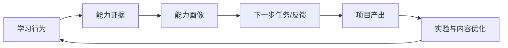

# Day20 产品战略与能力飞轮

<!-- architecture
{"title":"产品能力增长飞轮","summary":"学习行为形成能力证据，能力画像驱动下一步任务和实验，实验结果再改进课程与产品路线。","type":"flywheel","nodes":[{"id":"n1","label":"学习行为","group":"g1"},{"id":"n2","label":"能力证据","tone":"system","group":"g1"},{"id":"n3","label":"能力画像","group":"g1"},{"id":"n4","label":"下一步任务","tone":"accent","group":"g1"},{"id":"n5","label":"项目产出","group":"g1"},{"id":"n6","label":"实验优化","tone":"warning","group":"g1"},{"id":"n7","label":"路线图决策","tone":"system","group":"g2"}],"feedback":"实验结论回流到课程、题目和产品优先级。","renderMode":"diagram","edges":[{"from":"n1","to":"n2","relation":"primary"},{"from":"n2","to":"n3","relation":"primary"},{"from":"n3","to":"n4","relation":"primary"},{"from":"n4","to":"n5","relation":"primary"},{"from":"n5","to":"n6","relation":"primary"},{"from":"n6","to":"n7","relation":"primary"},{"from":"n7","to":"n1","relation":"feedback","label":"回流"}],"groups":[{"id":"g1","label":"飞轮循环","kind":"lane"},{"id":"g2","label":"策略决策","kind":"lane"}]}
-->

## Today Goal

把学习能力做成持续增强的产品，而不是一次性课程目录。

## Why This Matters

课程完成不等于能力形成。真正的 AI 学习产品需要持续收集能力证据、观察迁移效果、设计实验，并把内容、工具和评估一起迭代。

## Core Concepts

- **Capability evidence**：能证明能力的不是阅读时长，而是任务提交、架构判断、测验、项目结果和复盘。
- **North Star metric**：北极星指标应连接用户价值与产品增长，例如“每周完成可复核项目证据的学习者”。
- **Guardrail metric**：护栏指标防止单一目标伤害质量，例如错误建议率、成本、投诉和放弃率。
- **Experiment loop**：每次改课程、题目或反馈，都要定义假设、样本、指标、停止条件和复盘。

## Underlying Architecture

建议使用 **能力飞轮图**：学习行为产生证据，证据更新能力画像，画像驱动下一步任务和内容优化，实验结果再回到产品路线。

## Data And Logic Flow

输入是学习行为、答案、实践提交、项目证据和反馈；系统生成能力证据与画像；产品根据薄弱能力推荐任务；实验比较不同内容或反馈策略；输出是能力提升、课程改进和路线图决策。

## Key Technical Points

- 不要用日活替代学习成果，活跃度只是辅助指标。
- 能力画像必须能追溯证据，否则会变成不可解释标签。
- A/B 实验要避免把难度、用户基础和内容质量混在一起。
- 90 天路线图应包含假设、实验、交付和停止条件。

## Upstream Dependencies And Downstream Applications

- 上游依赖：课程 schema、测验、实践证据、导出记录、用户反馈。
- 下游应用：AI 教练、团队能力视图、内容治理、产品路线图和商业化评估。

## Production Example

学习者完成“多租户 RAG 架构评审”后，系统记录相关能力证据，并推荐安全门禁任务；产品团队观察到安全题放弃率高，于是实验更换案例和复盘提示。

## Counterexample

团队只看每日访问量和课程完成数，不检查项目证据质量；结果用户刷完课程仍无法独立设计 AI 功能。

## Hands-On Practice

定义一个北极星指标、三项护栏指标和一个 P0 课程实验。交付物包括指标定义、数据来源、实验假设、成功阈值、停止条件和 90 天路线图。

## Exploration Prompt

把 Day01-Day20 分成三个能力阶段，设计每个阶段最能证明能力迁移的一份证据。

## Quiz

1. 能力证据和学习活跃度有什么区别？
2. 什么样的指标适合作为北极星指标？
3. 护栏指标防止什么问题？
4. 实验设计为什么需要停止条件？

## Review And Reinforcement

- 写出 90 天路线图中的三个假设。
- 为一个课程改动定义成功和失败信号。
- 检查每个能力标签是否能追溯到证据。

## References

- https://www.lennysnewsletter.com/p/north-star-metric
- https://www.nngroup.com/articles/ab-testing/
- https://platform.openai.com/docs/guides/evals
