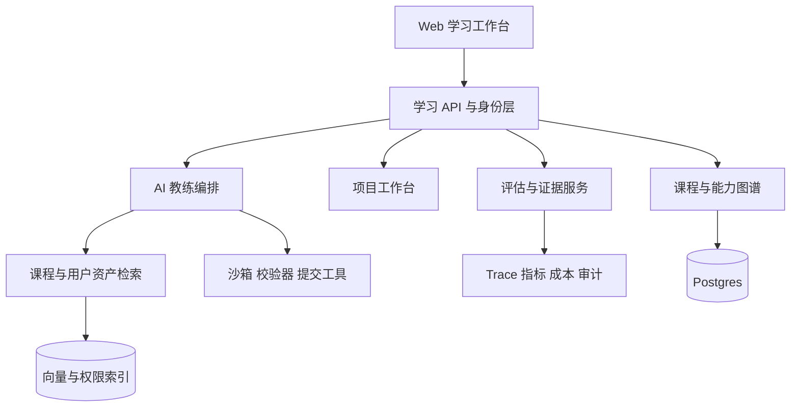
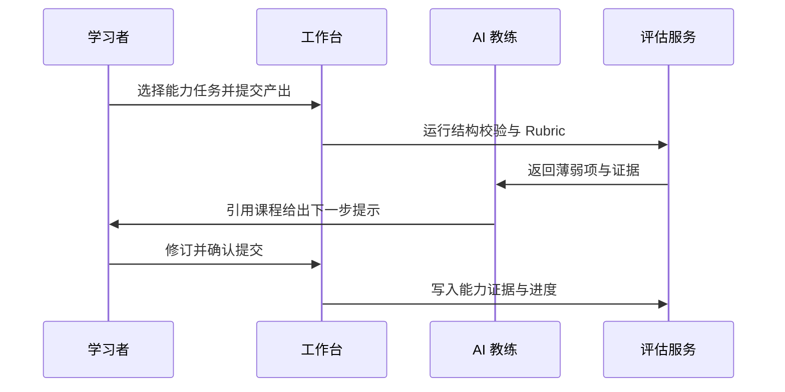

## 1. 产品愿景

让有工程基础的学习者以真实交付为单位学习 AI：看懂概念、完成设计或代码任务、获得基于证据的反馈，并沉淀可展示的能力档案。

## 2. 用户与问题

| 用户 | 当前痛点 | 产品结果 |
| --- | --- | --- |
| 有经验的全栈工程师 | 课程碎片化，无法判断是否能上生产 | 获得任务、架构判断与可验证产出 |
| 技术负责人 | 团队 AI 能力难盘点，培训无法量化 | 看到能力矩阵、项目证据与风险项 |
| 自学者 | 只做选择题，难迁移到真实项目 | 在项目工作台完成 PRD、架构、Eval 与复盘 |

## 3. 现状与缺口

现有 MVP 已有 Day01–Day13、数据驱动课程、路由、练习、复盘和本地 JSON 导出。它缺少登录与云同步、跨课程能力画像、开放式任务验收、项目资产、检索型 AI 教练、评估体系、团队协作及运营控制。

## 4. 产品架构

## 5. 核心能力与验收标准

### 5.1 学习路径与能力画像

- 以能力而非章节追踪：RAG、Agent、安全、评估、交付等维度显示“理解—练习—可独立交付”。
- 每个能力必须关联至少一份可复核证据（任务提交、测验、架构评审或项目结果）。
- 验收：用户完成一项任务后，能看见能力变化的原因和证据链接。

### 5.2 项目工作台

- 提供真实项目模板：内部知识助手、PRD 评审 Agent、会议行动项、客服 RAG。
- 每个模板包含边界、数据契约、架构图、Eval、风险清单和发布 checklist。
- 验收：项目可保存里程碑、提交链接与复盘；未完成审批/评估不可标记为“生产就绪”。

### 5.3 AI 教练

- 只基于课程、任务和用户提交提供提示；引用来源并区分“建议”与“事实”。
- 使用分层工具：解释可自动执行；生成任务草稿需确认；对外写入一律审批。
- 验收：每次反馈保存问题、来源、建议、采纳状态与用户评分。

### 5.4 评估与反馈

- 选择题保留；新增 Rubric、结构化提交校验、人工抽检与项目级 Eval。
- 指标：任务完成率、证据有效率、复学率、能力提升率；护栏：错误建议率、AI 成本/活跃用户、投诉率。
- 验收：任一课程/教练变更能在 golden set 上比较质量、成本与延迟。

## 6. 关键流程

## 7. 非功能与治理

- **安全**：租户隔离、RBAC、敏感内容分类、Prompt Injection 测试、工具最小权限、审批与审计。
- **可靠性**：学习进度本地优先、云端同步冲突可见；关键提交幂等；AI 服务可降级为静态课程。
- **性能**：课程首屏 p75 小于 2 秒；教练首 token p75 小于 3 秒；异步评估提供进度与重试。
- **成本**：按任务记录 token、检索、工具与存储成本；预算超限时路由到轻量模型或暂停非必要教练功能。

## 8. 发布路线图

| 阶段 | 范围 | 成功信号 |
| --- | --- | --- |
| P0：课程升级 | Day14–Day20、统一课程 schema、学习计划导入 | 完成率与满意度不低于现状 |
| P1：个人闭环 | 登录、云端进度、能力画像、项目模板 | 30% 完成者提交一项项目证据 |
| P2：AI 教练 | 课程 RAG、引用反馈、Rubric 与 Eval | 建议采纳率提升且错误建议受控 |
| P3：团队版 | 团队路径、管理员视图、内容治理 | 团队可比较能力缺口与学习效果 |

## 9. 风险与决策

- 不把“AI 自动评分”当作最终事实：高价值任务采用 Rubric + 人工抽检。
- 不在首版构建通用多 Agent 平台：优先完成单一教练工作流与明确工具边界。
- 不用活跃度替代学习成果：北极星指标为“完成可复核项目证据的周活跃学习者”。
