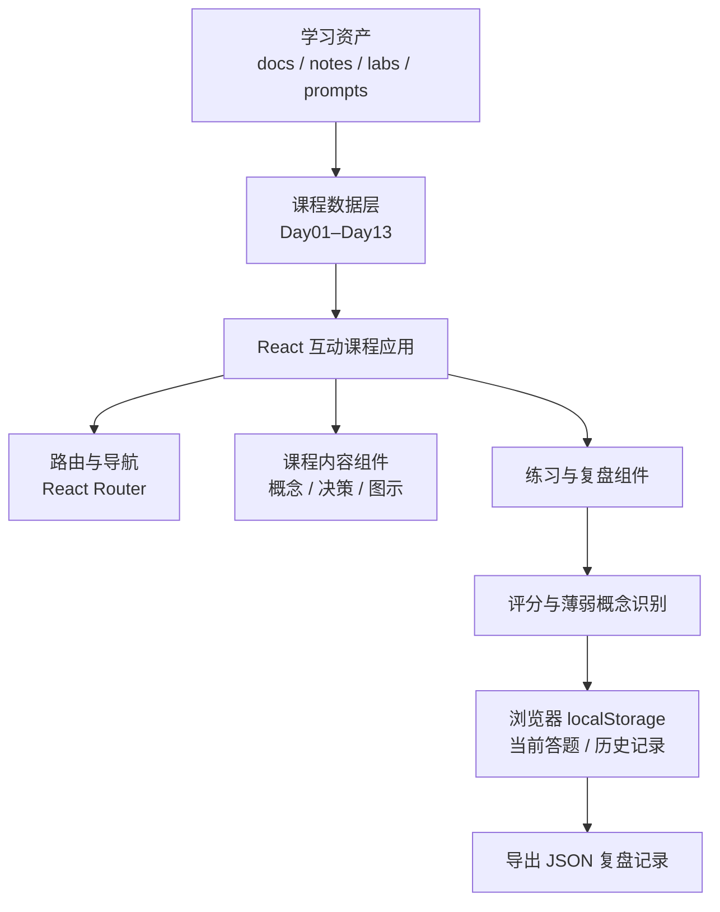
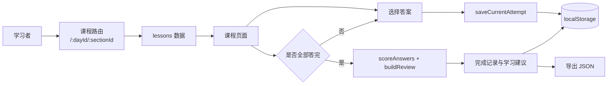
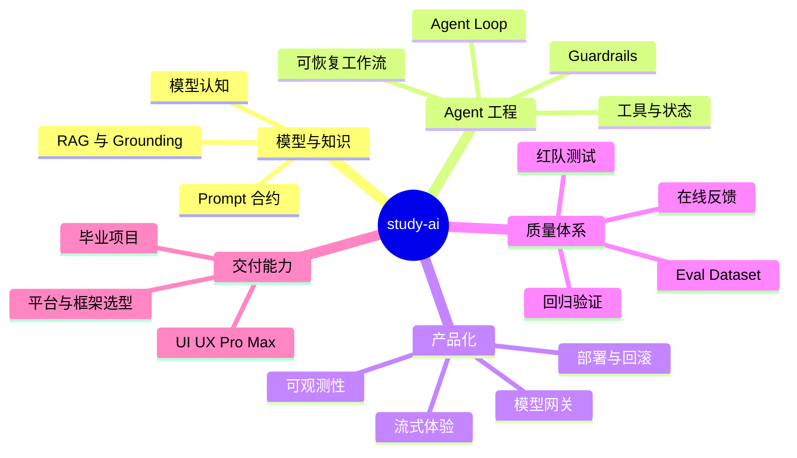

## 项目定位

`study-ai` 是一个面向工程实践的 AI Agent 学习项目。它不把学习限制在概念阅读，而是把学习路线、专题笔记、动手实验、可复用 Prompt 模式和可运行的互动课程组织成一个持续复盘的工作台。

**核心目标：帮助已有前后端经验的学习者，从理解模型边界走到能够交付可评估、可观测、可维护的 AI 产品。**

## 项目资产结构

| 层级 | 位置 | 作用 |
| --- | --- | --- |
| 学习路线与设计文档 | `docs/` | 维护系统学习计划、每日互动课程、设计说明与实施计划。 |
| 概念笔记 | `notes/` | 按主题沉淀模型认知等核心知识。 |
| 动手实验 | `labs/` | 将概念转成可执行判断、练习与产出。 |
| Prompt 资产 | `prompts/` | 保存可复用的 Prompt 模式。 |
| 互动课程应用 | `apps/interactive-lessons/` | 提供课程浏览、练习、评分、复盘与记录导出。 |

## 应用架构

互动课程应用是一个纯前端 React + TypeScript + Vite 项目。课程内容以类型化数据维护，页面根据路由选择课程，再将课程拆分为系列入口、概念讲解、决策框架、做题练习和复盘记录等区域。评分和学习记录由浏览器 `localStorage` 持久化，因此当前版本可静态部署。



## 学习数据流

学习者通过 URL 进入某一日课程和具体章节。应用从课程数据中找到对应 Lesson，渲染模块和题目；每次答题立即保存当前记录。完成后，系统计算得分、错题对应的薄弱概念与建议，将完成记录写入历史列表，并允许用户导出 JSON。



## 学习主题思维导图

课程主线从模型基础逐步扩展到工程控制、平台选型、可恢复工作流、评估与最终交付。代码当前已包含 Day01–Day13；其中 Day13 将 UI/UX Pro Max 的设计数据、规则检索、设计系统和验收闭环纳入课程体系。



## 课程与交互设计

| 维度 | 实现方式 |
| --- | --- |
| 课程组织 | 以 Day01–Day13 的类型化 `LessonPage` 数据组织，每日包含模块、决策层和题目。 |
| 导航体验 | 使用 React Router 管理独立课程页与章节锚点；滚动位置会同步到当前章节路由。 |
| 学习内容 | 每日围绕概念、工程视角、常见陷阱、练习提示、生产案例和架构示意展开。 |
| 练习与反馈 | 单选题覆盖课程概念；完成后根据错题识别薄弱概念并生成复习建议。 |
| 本地记录 | 当前答题、完成历史和偏好按课程 ID 存入 `localStorage`，并支持删除、清空、重试与 JSON 导出。 |
| 可访问性 | 提供“跳到课程内容”链接、语义化按钮、ARIA 标签与键盘可用的导航控件。 |

## 工程质量与当前边界

- **数据与视图分离**：课程文本、模块、题目与类型定义集中在 `src/data/`；页面、组件、评分逻辑和存储逻辑分别拆分。
- **质量验证**：Vitest 覆盖路由同步、导航折叠、课程连续性、架构图渲染、题目概念覆盖，以及评分和存储逻辑。
- **部署方式**：Vite 使用相对资源路径，可构建为静态 `dist` 目录并部署到 GitHub Pages 的仓库子路径。
- **当前边界**：应用不包含服务端、账号体系或云端学习进度同步；所有学习进度仅保存在当前浏览器。
- **文档待同步项**：README 中仍写“Day01–Day04”，而代码和测试已支持 Day01–Day13；交互课程总览也尚未列出 Day13，建议后续同步说明。

## 常用命令

```bash
npm run lesson:dev
npm run lesson:test
npm run lesson:build
npm run lesson:dist
```

`lesson:dist` 会在 `apps/interactive-lessons/dist` 生成可发布的静态文件。
